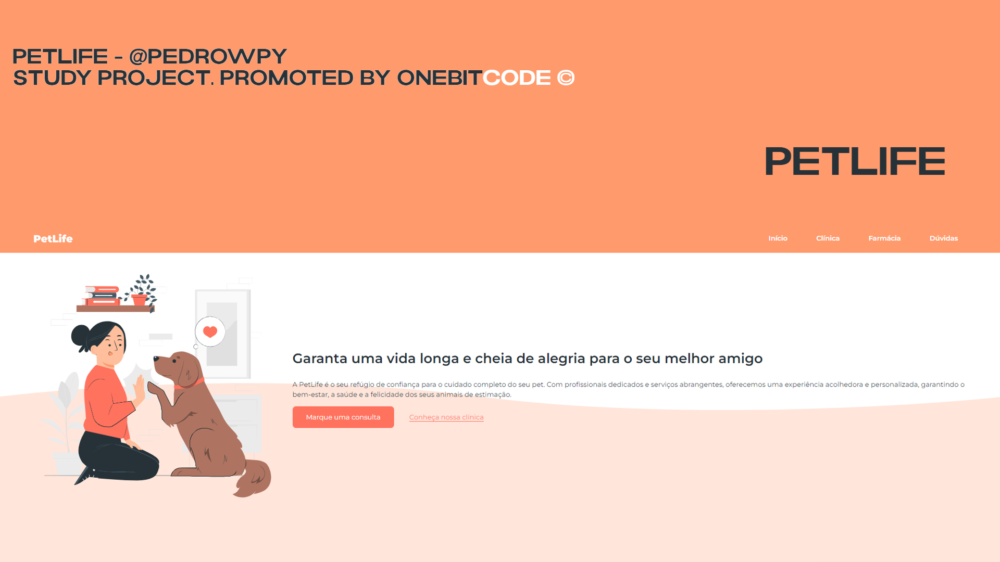

<h1 align="center"> PetLife </h1>

Evento exclusivo e gratuito, promovido pela OneBitCode para ensino de tecnologias WEB.

  <a href="#-tecnologias">Tecnologias</a>&nbsp;&nbsp;&nbsp;|&nbsp;&nbsp;&nbsp;
  <a href="#-projeto">Projeto</a>&nbsp;&nbsp;&nbsp;|&nbsp;&nbsp;&nbsp;
  <a href="#-layout">Layout</a>&nbsp;&nbsp;&nbsp;|&nbsp;&nbsp;&nbsp;
  <a href="#memo-licença">Licença</a>

  

 

  

## 🚀 Tecnologias

Esse projeto foi desenvolvido com as seguintes tecnologias:

- HTML e CSS
- JavaScript
- Git e Github
- Figma

## 💻 Projeto

O PetLife é um site desenvolvido para uma clínica veterinária, explorando estudos na área de front-end.

## 🔖 Layout

Você pode visualizar o layout do projeto acessando o diretório.

## :memo: Licença

Esse projeto está sob a licença MIT.

---

Feito por @pedrowpy na Trilha Inicial da OneBitCode :wave:
